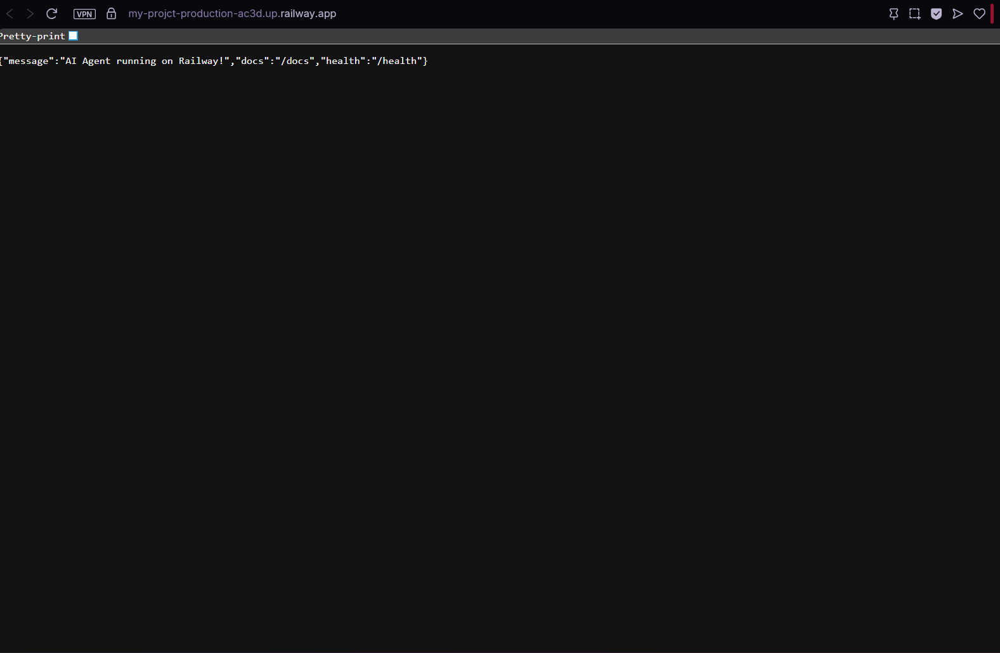
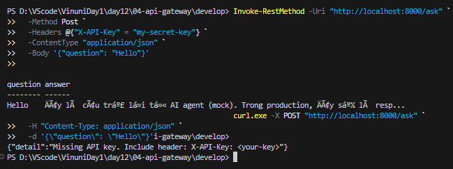
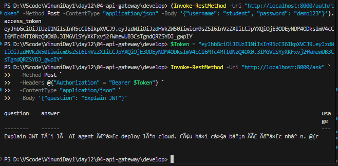
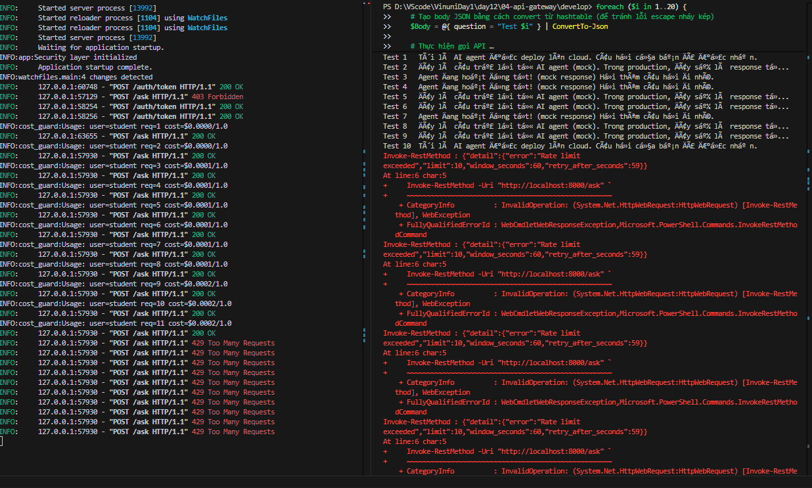
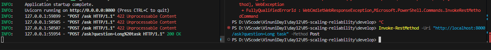
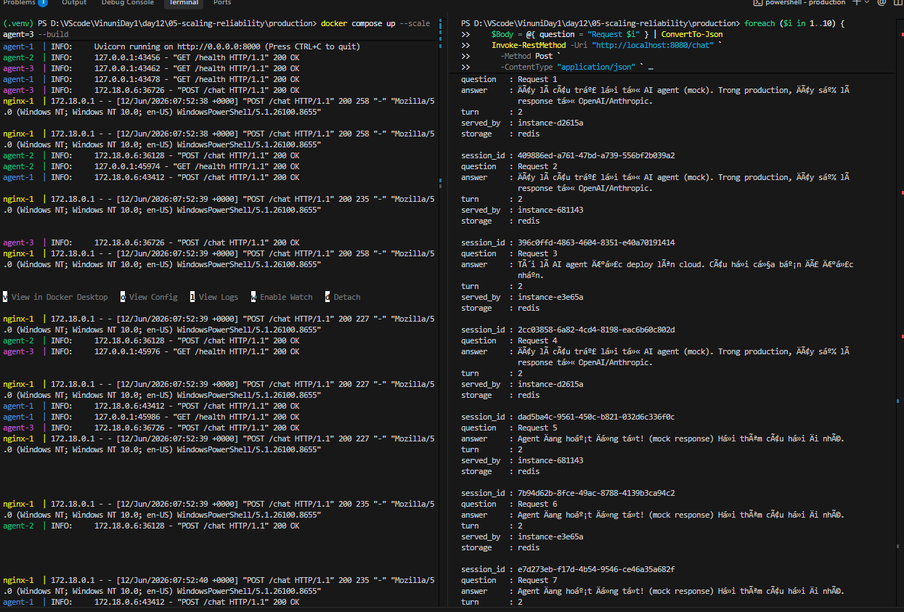
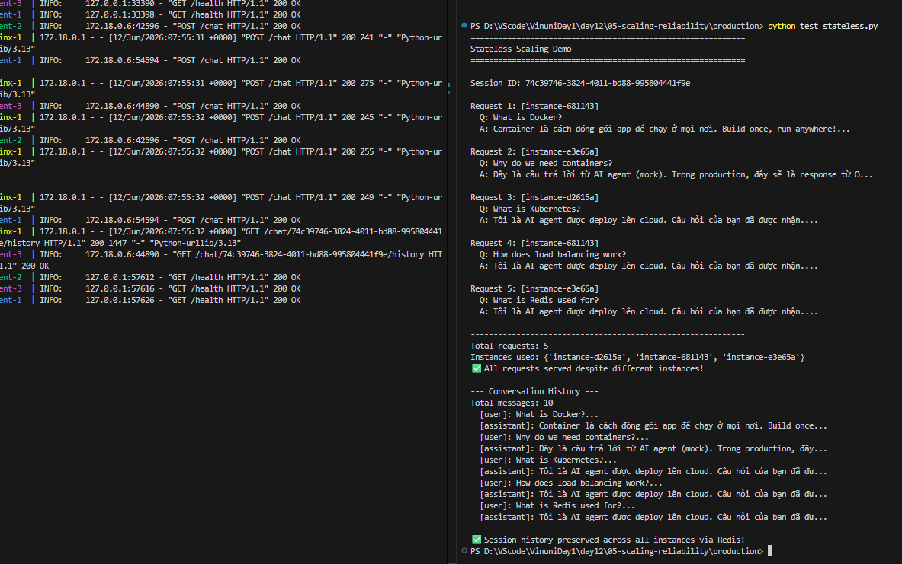

# Day 12 Lab - Mission Answers

## Part 1: Localhost vs Production

### Exercise 1.1: Anti-patterns found
1. API key hardcode in
2. Khong co config management
3. Print thay gi co logging
4. Khong co healthcheck
5. Port co dinh, khong doc tren environment
6. Agent chay local

### Exercise 1.3: Comparison table
| Feature | Basic | Advanced | Tại sao quan trọng? |
|---------|-------|----------|---------------------|
| Config | Hardcode | Env vars | Bảo mật, tránh lộ API key. Linh hoạt, đổi config không cần sửa code. |
| Health check |  |  | Giúp Cloud Platform tự restart nếu app treo và Load Balancer chỉ gửi request khi app đã sẵn sàng. |
| Logging | print() | JSON | Dễ phân tích qua công cụ thu thập log. Tránh in thông tin nhạy cảm. |
| Shutdown | Đột ngột | Graceful | Đảm bảo hoàn thành các request đang chạy và đóng kết nối an toàn để không mất dữ liệu. |

## Part 2: Docker

### Exercise 2.1: Dockerfile questions
1. Base image: Là môi trường nền móng hoặc hệ điều hành có sẵn (ví dụ: python:3.11) dùng để chạy ứng dụng của bạn.
2. Working directory: Là thư mục làm việc mặc định bên trong container (các lệnh COPY, RUN, CMD sẽ thực thi tại đây).
3. Để tận dụng Docker Layer Cache, tránh cài đặt lại các thư viện/dependencies khi bạn chỉ thay đổi source code.
4. ENTRYPOINT đặt lệnh cố định không thể ghi đè khi chạy container. CMD đặt tham số mặc định và dễ dàng bị ghi đè từ command line (docker run).

### Exercise 2.3: Image size comparison
- Develop: [242] MB
- Production: [56.6] MB
- Difference: [430]%

## Part 3: Cloud Deployment

### Exercise 3.1: Railway deployment
- URL: https://my-projct-production-ac3d.up.railway.app
- Screenshot:

## Part 4: API Security

### Exercise 4.1-4.3: Test results
Key test 

Token test
  

Rate test
  
### Exercise 4.4: Cost guard implementation
1. Lấy thông tin tiêu dùng trong ngày: Gọi _get_record(user_id) để lấy bản ghi chi phí đã sử dụng trong ngày hôm nay của user.
2. Kiểm tra ngân sách hệ thống (Global Budget): Nếu tổng chi phí của toàn hệ thống (_global_cost) vượt quá giới hạn ngày, chặn request và trả về lỗi 503 Service Unavailable.
3. Kiểm tra ngân sách cá nhân (User Budget): Nếu chi phí của riêng user đó (total_cost_usd) vượt quá giới hạn ngày, chặn request và trả về lỗi 402 Payment Required.
4. Cảnh báo khi sắp hết: Nếu chi phí đã dùng đạt ngưỡng cảnh báo (ví dụ: 80% hạn mức), ghi nhận log warning để thông báo.

## Part 5: Scaling & Reliability

### Exercise 5.1-5.5: Implementation notes
- 5.1 /health: Kiểm tra ứng dụng có chạy bth không hây bị treo bằng cách tính thời gian uptime và ram sũ dụng.    
/ready: kiểm tra ứng đụng có sãn sàng chưa, nếu chưa trả 503.

- 5.2 
Graceful shutdown test success

- 5.4
Ran load balancer test  

- 5.5 
Ran Stateless test

